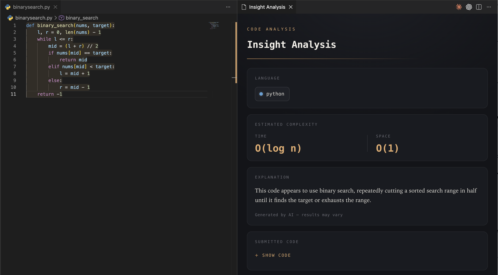

# Insight

Insight is a VS Code extension that explains selected code and detects common algorithmic patterns using a hybrid local-analysis and LLM pipeline.

The system combines a TypeScript VS Code extension, a FastAPI backend, Tree-sitter AST parsing, a scikit-learn classifier, and Gemini fallback. For recognized algorithmic code, Insight can classify the pattern locally and skip the LLM call. For unknown or low-confidence code, it falls back to Gemini for a natural-language explanation.
<p align="center">

  

</p>
## Overview

Insight was built to make code comprehension faster inside VS Code. A user selects code, runs the Insight command, and receives a concise explanation, time complexity, space complexity, and metadata about whether the result came from the local classifier or Gemini.

The backend first attempts a local static-analysis path:

```text
Code snippet
→ Tree-sitter parser
→ AST feature extraction
→ scikit-learn classifier
→ Local explanation if confidence is high
→ Gemini fallback if unknown or low-confidence
```

This makes the project more than a simple wrapper around an LLM. Insight uses local program-structure features to avoid unnecessary LLM calls for common algorithmic patterns.

## Features

- VS Code command for analyzing selected code
- FastAPI backend for code analysis
- Gemini integration for natural-language explanations
- Tree-sitter parsing for source-code AST generation
- AST feature extraction for structural code analysis
- scikit-learn classifier for detecting common algorithm patterns
- Local explanation path for high-confidence predictions
- Gemini fallback path for unknown or low-confidence code
- Benchmarking script for measuring local classifier latency versus Gemini latency
- Folder-based dataset structure for retraining the classifier

## Supported Algorithm Patterns

The local classifier currently recognizes these labels:

- `binary_search`
- `bfs`
- `dfs`
- `dynamic_programming`
- `hash_map`
- `sliding_window`
- `sorting`
- `stack`
- `two_pointers`
- `unknown`

The local classifier is trained on Python examples. The language configuration layer includes broader Tree-sitter language aliases, but the current classifier should be treated as Python-focused unless additional multilingual training data is added.

## Architecture

```text
frontend/
  VS Code extension
  TypeScript command registration
  Sends selected code to backend

backend/
  FastAPI application
  /analyze endpoint
  Gemini client
  Tree-sitter parser
  AST feature extractor
  scikit-learn model
  benchmark and training scripts
```

Runtime flow:

```text
VS Code selection
→ POST /analyze
→ Normalize code/language
→ Try local classifier
    → Parse with Tree-sitter
    → Extract AST features
    → Predict algorithm pattern
    → If confident, return local explanation
→ Otherwise call Gemini
→ Return explanation and metadata
```

## Tech Stack

### Frontend

- TypeScript
- VS Code Extension API
- Node.js / npm

### Backend

- Python
- FastAPI
- Uvicorn
- Pydantic
- Gemini API
- Tree-sitter
- tree-sitter-languages
- scikit-learn
- pandas
- numpy
- joblib

## Repository Structure

```text
Insight/
  README.md

  frontend/
    package.json
    src/
      extension.ts
    dist/
      extension.js
    .vscode/
      launch.json

  backend/
    requirements.txt
    app/
      main.py
      schemas.py

      core/
        config.py
        language_config.py
        parser.py
        ast_features.py

      gemini/
        gemini_client.py
        gemini_prompts.py

      services/
        analyze.py

      models/
        predict.py
        train_model.py
        train_from_folders.py
        import_leetcode_csv.py
        benchmark_classifier.py
        algorithm_classifier.pkl
        algorithm_classifier_metrics.json
        benchmark_results.json

    data/
      algorithm_examples/
        binary_search/
        bfs/
        dfs/
        dynamic_programming/
        hash_map/
        sliding_window/
        sorting/
        stack/
        two_pointers/
        unknown/
      dataset_manifest.json
```

## Backend Setup

From the repository root:

```bash
cd backend
pip install -r requirements.txt
```

Set up your Gemini API key and model in your environment.

Example `.env`:

```env
GEMINI_API_KEY=your_api_key_here
GEMINI_MODEL=gemini-3.1-flash-lite
```

Then run the backend:

```bash
uvicorn app.main:app --reload
```

The API should be available at:

```text
http://127.0.0.1:8000
```

Interactive API docs:

```text
http://127.0.0.1:8000/docs
```

## Frontend Setup

Open the frontend folder:

```bash
cd frontend
npm install
npm run compile
code .
```

To test the extension locally:

1. Start the backend in a separate terminal:

```bash
cd backend
uvicorn app.main:app --reload
```

2. Open `frontend/` in VS Code.
3. Run the extension using the VS Code debugger.
4. This opens a new window called **Extension Development Host**.
5. In the Extension Development Host window, open a Python file.
6. Select code.
7. Open the Command Palette with `Cmd + Shift + P`.
8. Search for the Insight command and run it.

## API Usage

### `POST /analyze`

Request body:

```json
{
  "code": "def binary_search(nums, target):\n    l, r = 0, len(nums) - 1\n    while l <= r:\n        mid = (l + r) // 2\n        if nums[mid] == target:\n            return mid\n        elif nums[mid] < target:\n            l = mid + 1\n        else:\n            r = mid - 1\n    return -1",
  "language": "python",
  "source": "manual"
}
```

Example local-classifier response:

```json
{
  "explanation": "This code appears to use binary search, repeatedly cutting a sorted search range in half until it finds the target or exhausts the range.",
  "time_complexity": "O(log n)",
  "space_complexity": "O(1)",
  "model": "local_algorithm_classifier",
  "algorithm": "binary_search",
  "confidence": 0.72,
  "gemini_used": false,
  "analysis_source": "local_model",
  "status": "success"
}
```

Example Gemini fallback response:

```json
{
  "explanation": "This function retrieves user data from a remote API by sending an HTTP GET request with a specific user ID and parsing the resulting JSON response.",
  "time_complexity": "O(1) relative to the function logic, though dependent on network latency and API response time.",
  "space_complexity": "O(N) where N is the size of the JSON response body.",
  "model": "gemini",
  "algorithm": null,
  "confidence": null,
  "gemini_used": true,
  "analysis_source": "gemini",
  "status": "success"
}
```

## Local Classifier

The local classifier uses Tree-sitter and scikit-learn.

The pipeline is:

```text
source code
→ Tree-sitter AST
→ structural features
→ scikit-learn classifier
→ algorithm label + confidence
```

Extracted AST features include signals such as:

- total node count
- unique node type count
- maximum nesting depth
- loop count
- conditional count
- function count
- call count
- assignment count
- return count
- binary expression count
- data-structure usage indicators
- recursion and traversal-like patterns

If the predicted label is known and confidence is high enough, the backend returns a local explanation and marks:

```json
"gemini_used": false
```

If the classifier returns `unknown`, has low confidence, or cannot parse the code, the backend falls back to Gemini.

## Training the Classifier

The classifier can be trained from the folder-based dataset:

```bash
cd backend
python -m app.models.train_from_folders
```

This reads examples from:

```text
backend/data/algorithm_examples/<label>/*.py
```

and saves the trained model to:

```text
backend/app/models/algorithm_classifier.pkl
```

It also writes metrics to:

```text
backend/app/models/algorithm_classifier_metrics.json
```

Current dataset structure:

```text
backend/data/algorithm_examples/
  binary_search/
  bfs/
  dfs/
  dynamic_programming/
  hash_map/
  sliding_window/
  sorting/
  stack/
  two_pointers/
  unknown/
```

Each folder contains labeled Python examples for that algorithm pattern.

## Benchmarking

Insight includes a benchmark script for comparing local classifier latency against direct Gemini calls.

Local-only benchmark:

```bash
cd backend
python -m app.models.benchmark_classifier --limit-per-label 25
```

Benchmark with Gemini comparison:

```bash
python -m app.models.benchmark_classifier --limit-per-label 10 --include-gemini --gemini-limit 10
```

Example benchmark result:

```json
{
  "total_examples": 100,
  "local_classifier": {
    "latency": {
      "median_ms": 13.203,
      "p90_ms": 13.547
    },
    "skip_rate": 0.9,
    "accuracy_against_folder_labels": 1.0,
    "known_algorithm_skip_rate": 1.0
  },
  "gemini_direct": {
    "latency": {
      "median_ms": 1330.896
    },
    "attempted_calls": 10,
    "successful_calls": 10
  },
  "estimated_median_latency_reduction_vs_gemini": 0.9901
}
```

In this benchmark, the local classifier achieved approximately 13 ms median latency, while direct Gemini calls had approximately 1331 ms median latency. This produced a measured 99.0% median latency reduction for recognized algorithmic patterns in the benchmark setup.

The benchmark result should be interpreted as a controlled local benchmark, not as a production-wide guarantee.

## Example Manual Tests

### Binary Search

```bash
curl -X POST http://127.0.0.1:8000/analyze \
  -H "Content-Type: application/json" \
  -d '{
    "code": "def binary_search(nums, target):\n    l, r = 0, len(nums) - 1\n    while l <= r:\n        mid = (l + r) // 2\n        if nums[mid] == target:\n            return mid\n        elif nums[mid] < target:\n            l = mid + 1\n        else:\n            r = mid - 1\n    return -1",
    "language": "python",
    "source": "manual"
  }'
```

Expected behavior:

```json
{
  "model": "local_algorithm_classifier",
  "algorithm": "binary_search",
  "gemini_used": false,
  "analysis_source": "local_model"
}
```

### General API Code

```bash
curl -X POST http://127.0.0.1:8000/analyze \
  -H "Content-Type: application/json" \
  -d '{
    "code": "import requests\n\ndef fetch_user(user_id):\n    response = requests.get(f\"https://api.example.com/users/{user_id}\")\n    return response.json()",
    "language": "python",
    "source": "manual"
  }'
```

Expected behavior:

```json
{
  "model": "gemini",
  "algorithm": null,
  "gemini_used": true,
  "analysis_source": "gemini"
}
```

## Why This Design

Calling an LLM for every snippet is slow and expensive. Many code snippets follow recognizable algorithmic patterns that can be detected using syntax structure alone.

Insight uses local classification first because it is:

- faster
- cheaper
- deterministic enough for common patterns
- easy to benchmark
- able to fall back to Gemini when uncertain

This hybrid approach gives the project a clear systems story:

```text
local static analysis where possible,
LLM reasoning where necessary
```

## Current Limitations

- The classifier is currently trained primarily on Python examples.
- The dataset is labeled by folder and should be expanded with more real-world examples over time.
- The benchmark is a local controlled benchmark, not a production traffic benchmark.
- The extension currently expects the backend to be running locally.
- The model should not be described as universally accurate across all programming languages.
- More robust confidence calibration would improve fallback decisions.

## Future Improvements

- Display `algorithm`, `confidence`, and `gemini_used` directly in the VS Code UI.
- Add fallback reasons such as `low_confidence`, `unknown_algorithm`, or `unsupported_language`.
- Add more real LeetCode/competitive-programming examples.
- Add multilingual training examples.
- Add model calibration and confusion-matrix reporting.
- Deploy the backend so the extension does not require a local server.
- Add integration tests for `/analyze`.
- Package and test the extension as a `.vsix`.

VS Code’s Extension Development Host.
